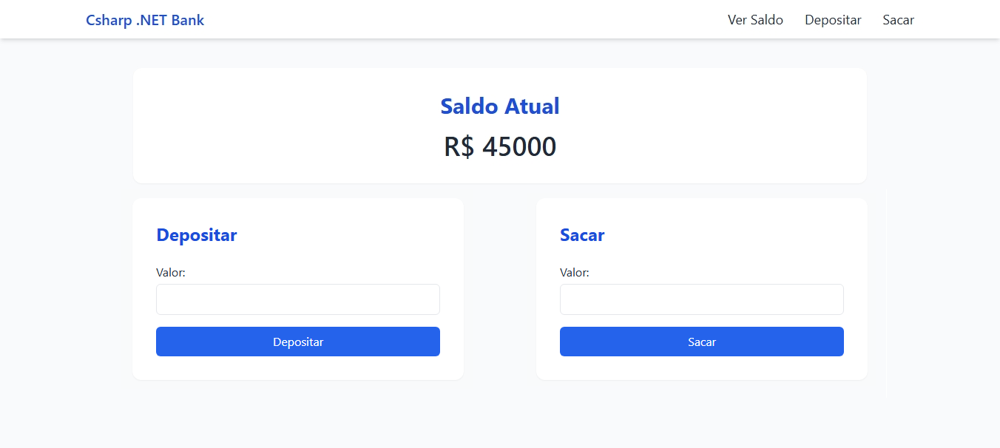

# CsharpDotNetBank --- Projeto Fintech em ASP.NET MVC (.NET 10)

O **CsharpDotNetBank** é um projeto simples e didático desenvolvido em
**C# com ASP.NET Core MVC (.NET 10)**, simulando as operações essenciais
de uma fintech:



-   ✔ **Ver saldo**
-   ✔ **Depositar**
-   ✔ **Sacar**

O objetivo do projeto é servir como **portfólio profissional**, **estudo
prático de .NET MVC** e uma excelente introdução ao desenvolvimento
backend usando C#.

Ele demonstra: - Organização em **Controllers, Models, Views e
Services** - Roteamento MVC - Layout moderno com **Tailwind CSS via
CDN** - Navegação simples e responsiva - Redirecionamento da Home para a
tela de saldo - Manipulação de dados sem banco (em memória)

------------------------------------------------------------------------

# 🚀 Passo a passo para rodar o projeto

## ✅ Requisitos

-   Visual Studio com suporte ao **.NET 10**
-   Ou **.NET 10 SDK**
-   Não precisa de Node/NPM (Tailwind via CDN)

------------------------------------------------------------------------

## 📁 Estrutura do projeto

    CsharpDotNetBank
     ├── Controllers
     │     └── ContaController.cs
     ├── Models
     │     └── Conta.cs
     ├── Services
     │     └── ContaService.cs
     ├── Views
     │     ├── Conta
     │     │    ├── Index.cshtml
     │     │    ├── Saldo.cshtml
     │     │    ├── Depositar.cshtml
     │     │    └── Sacar.cshtml
     │     └── Shared
     │          └── _Layout.cshtml
     ├── Program.cs
     └── appsettings.json

------------------------------------------------------------------------

# ▶️ Como rodar no Visual Studio

1.  Abra o Visual Studio\
2.  Vá em **File → Open → Project/Solution**\
3.  Selecione **CsharpDotNetBank.csproj**\
4.  Verifique se o projeto está usando **.NET 10**\
5.  Pressione **F5** ou **Ctrl+F5**\
6.  Acesse no navegador: `https://localhost:XXXX`

A aplicação inicia automaticamente em:

    /Conta/Saldo

------------------------------------------------------------------------

# ▶️ Como rodar via terminal

``` bash
dotnet restore
dotnet build
dotnet run
```

------------------------------------------------------------------------

# 🎨 Tailwind CSS via CDN

No arquivo `_Layout.cshtml`:

``` html
<script src="https://cdn.tailwindcss.com"></script>
```

Funciona imediatamente no Visual Studio sem instalar nada.

------------------------------------------------------------------------

# 💰 Funcionalidades

### ✔ Ver Saldo

Mostra o saldo atual formatado.

### ✔ Depositar

Formulário estilizado com Tailwind.

### ✔ Sacar

Valida saldo insuficiente.

### ✔ Serviço de domínio

`ContaService.cs` contém toda a lógica.

### ✔ Dados em memória

Simples e ideal para aprendizado.

------------------------------------------------------------------------

# ❌ Erros comuns resolvidos

### 1) 404 ao iniciar

Corrigido via rota padrão:

``` csharp
pattern: "{controller=Conta}/{action=Index}/{id?}"
```

### 2) Error.cshtml ausente

Removido da pipeline --- não é necessário.

------------------------------------------------------------------------

# 🧩 Tecnologias utilizadas

-   C# 12\
-   .NET 10\
-   ASP.NET Core MVC\
-   Tailwind via CDN\
-   Razor Views

------------------------------------------------------------------------

# ⭐ Próximos passos sugeridos

-   EF Core + SQLite\
-   Histórico de transações\
-   API REST Minimal API\
-   Dashboard com gráficos\
-   Login/autenticação

------------------------------------------------------------------------

Desenvolvido por Aguinaldo Borges.
